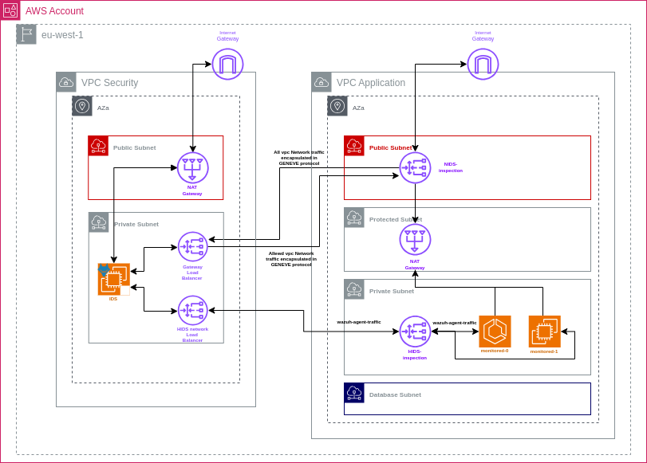

# Real-Time Threat Detection on AWS

This project sets up a real-time threat detection system on AWS using Wazuh, Suricata, GuardDuty and optionally bucket AV for malware scanning.

> **DISCLAIMER**: This is a demonstration project intended for educational purposes only. Some components may not function optimally in all environments, and the setup is not recommended for production use without additional hardening and configuration.

## Architecture



1. Monitored EC2 instances are the targets for security monitoring
2. IDS EC2 instance runs Wazuh, Suricata, and GLWBTun for security monitoring and traffic control
3. GuardDuty monitors for threats across the AWS environment
4. CloudTrail logs are stored in S3 and monitored by Wazuh
5. S3 Bucket AV scans for malware in uploaded files
6. SQS Queue receives notifications about malware detection
7. Wazuh dashboard provides a unified view of security events

## Getting Started

1. Generate access key for your AWS account
2. Run these commands:

```bash
cd terraform
ssh-keygen -f ./key
terraform apply
terraform output
```

The IDS EC2 instance uses user data to configure Wazuh, Suricata, and GLWBTun.

## Configure Environment

1. Start all instances
2. Copy the command from **wazuh_dashboard_access** from terraform output
3. Connect to wazuh dashboard [https://127.0.0.1:8443](https://127.0.0.1:8443).
Default credentials are `admin:SecretPassword`

### Configure AWS Cloud Monitoring in Wazuh

1. Create credentials for IAM Wazuh user in AWS console
2. Connect to the Wazuh machine
3. Create file `/root/wazuh/single/node/aws_credentials.env`:

   ```bash
   export AWS_ACCESS_KEY_ID=<PASTE-ACCESS-KEY>
   export AWS_SECRET_ACCESS_KEY=<PASTE-SECRET-KEY>
   ```

4. Update docker-compose to load the new env file:

   ```yaml
   services:
       wazuh.manager:
           hostname: wazuh.manager
           ...
           env_file:
           - path: aws_credentials.env
             required: true
   ```

5. Edit `/root/wazuh-docker/single-node/config/wazuh_cluster/wazuh_manager.conf` and add:

   ```xml
   <wodle name="aws-s3">
       <disabled>no</disabled>
       <interval>5m</interval>
       <run_on_start>yes</run_on_start>
       <skip_on_error>no</skip_on_error>

       <bucket type="cloudtrail">
           <name><WAZUH_AWS_BUCKET></name>
       </bucket>
   </wodle>
   ```

6. Replace **WAZUH_AWS_BUCKET** with `wazuh_trail_bucket` from terraform output
7. Restart compose with `docker-compose restart`

### Configure Suricata

1. Configure `/root/suricata/suricata.yaml` by replacing CIDRs of internal network and interface
2. Follow the [Wazuh-Suricata integration guide](https://documentation.wazuh.com/current/proof-of-concept-guide/integrate-network-ids-suricata.html)
3. Add the following to your Wazuh configuration:

    ```xml
   <ossec_config>
       <global>
           <logall_json>yes</logall_json>
       </global>
       <localfile>
           <log_format>json</log_format>
           <location>/var/log/suricata/eve.json</location>
       </localfile>
   </ossec_config>
   ```

### Bucket AV Configuration

To test bucket AV functionality:

1. Enable subscription by setting variable `create_bucket_av=true` in `default.auto.tfvars`
2. Subscribe to the service:
   - Open [this link](https://aws.amazon.com/marketplace/pp/prodview-sykoblbsdgw2o)
   - Click on "Try for free"
3. Run `terraform appl

## Demo Scripts

In the `scripts` folder, you'll find prepared scripts for demonstrations:

- `wazuh_demo.sh`: Starts Wazuh on the IDS instance, creates a tunnel for dashboard access, and performs SSH brute force attacks from monitored-0 to monitored-1
- `traffic_demo.sh`: Connects to the IDS instance and demonstrates how tc blocks ICMP packets and TCP on port 80 from the monitored subnet
- `malware_demo.sh`: Connects to the SQS queue where GuardDuty S3 malware protection sends notifications about scanned files

## Cleanup

Before running `terraform destroy`, make sure to empty all buckets.

## Known Issues

- User data scripts may not execute properly on instance launch. Manual configuration might be required.

## FAQ

**Q: Monitored instances cannot connect to the internet**  
A: Check if the GLWBTun service is running on the **IDS** machine.
